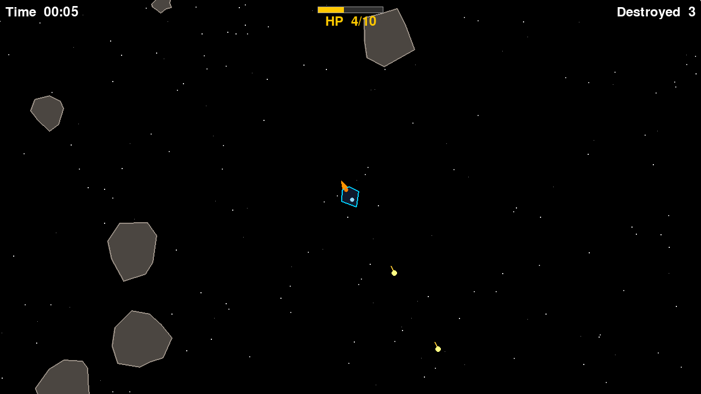

# 🚀 Asteroids Game

> A clone of the classic [Asteroids](https://en.wikipedia.org/wiki/Asteroids_(video_game)) arcade game built with **Python 3.13** and **pygame**.




---

## Table of Contents

- [Getting Started](#getting-started)
- [Docker](#docker)
- [Pre-built Executables](#pre-built-executables)
- [Controls](#controls)
- [Gameplay](#gameplay)
- [Development](#development)
- [Documentation](#documentation)

---

## Getting Started

Requires **Python 3.13** and [uv](https://docs.astral.sh/uv/).

```bash
# Install dependencies (including dev tools)
uv sync --all-groups

# Install pre-commit hooks (one-time)
uv run pre-commit install

# Run the game
uv run main.py
```

---

## Docker

Requires [Docker](https://www.docker.com/). The image sets `SDL_AUDIODRIVER=dummy`
automatically; you must forward your X11 display so pygame can open a window.

```bash
# Build
docker build -t asteroids .

# Run (Linux with X11)
xhost +local:docker
docker run --rm \
  -e DISPLAY=$DISPLAY \
  -v /tmp/.X11-unix:/tmp/.X11-unix \
  asteroids
```

> **macOS / Windows** — install [XQuartz](https://www.xquartz.org/) (macOS) or
> [VcXsrv](https://sourceforge.net/projects/vcxsrv/) (Windows), start it, then
> set `DISPLAY` accordingly before running the command above.

---

## Pre-built Executables

Standalone executables for **Windows**, **macOS**, and **Linux** are built
automatically by GitHub Actions on every version tag push.

| Platform | Artifact | Output |
|----------|----------|--------|
| Windows | `asteroids-windows` | `asteroids.exe` |
| macOS | `asteroids-macos` | `asteroids` |
| Linux | `asteroids-linux` | `asteroids` |

Download from the
[Actions tab](https://github.com/sirtaylor88/asteroids-game-using-pygame/actions/workflows/release.yml)
(workflow artifacts) or from the
[Releases page](https://github.com/sirtaylor88/asteroids-game-using-pygame/releases)
when a tag is published.

To trigger a build and release manually:

```bash
git tag v1.0.0
git push origin v1.0.0
```

To build locally (requires Python 3.13 and uv):

```bash
bash scripts/build_exe.sh
# Output: dist/asteroids  (dist/asteroids.exe on Windows)
```

---

## Controls

| Key | Action |
|-----|--------|
| `W` / `↑` | Thrust forward |
| `S` / `↓` | Thrust backward |
| `A` / `←` | Rotate left |
| `D` / `→` | Rotate right |
| `Space` | Shoot |

---

## Gameplay

- Jagged rock-shaped asteroids spawn continuously from the screen edges, drifting and slowly rotating inward.
- Shoot an asteroid to split it into two smaller, faster ones.
- Small asteroids (minimum radius) are destroyed outright when shot.
- A flickering thrust flame appears behind your ship when accelerating forward.
- Your ship has **10 HP**. A large asteroid hit costs 3 HP; a small one costs 1 HP.
- After taking a hit the ship is invincible for 1.5 s and flashes to signal it.
- When HP reaches 0 an explosion plays at the ship's position and the game over screen appears.
- The HUD shows your survival time (top-left), HP bar (top-centre), and asteroid kill count (top-right).

---

## Development

### Code quality

| Tool | Purpose | Docs |
|------|---------|------|
| [ruff](https://docs.astral.sh/ruff/) | Lint + import sort | `uv run ruff check .` |
| [pylint](https://pylint.readthedocs.io/) | Extended lint | `uv run pylint main.py logger.py core/` |
| [mypy](https://mypy.readthedocs.io/) | Type checking | `uv run mypy .` |
| [bandit](https://bandit.readthedocs.io/) | Security scan | `uv run bandit -r . -c pyproject.toml` |
| [pydocstyle](https://www.pydocstyle.org/) | Docstring style | `uv run pydocstyle .` |

All of the above run automatically on every commit via
[pre-commit](https://pre-commit.com/) hooks (see `.pre-commit-config.yaml`).

### Tests

Uses [pytest](https://docs.pytest.org/) with a headless [SDL](https://www.libsdl.org/)
driver so no display is needed.

```bash
uv run pytest                         # all 47 tests
uv run pytest tests/test_asteroid.py  # single module
uv run pytest --cov                   # with coverage report
```

### Scripts

| Script | Purpose |
|--------|---------|
| `scripts/build_exe.sh` | Build a standalone executable locally (all platforms) |
| `scripts/screenshot.py` | Render 360 frames and save `docs/source/_static/screenshot.png` |

```bash
bash scripts/build_exe.sh          # build executable
uv run scripts/screenshot.py       # regenerate README screenshot
uv run scripts/screenshot.py out.png  # save to a custom path
```

### Documentation

Built with [Sphinx](https://www.sphinx-doc.org/) using the
[autodoc](https://www.sphinx-doc.org/en/master/usage/extensions/autodoc.html) and
[Napoleon](https://www.sphinx-doc.org/en/master/usage/extensions/napoleon.html)
extensions (Google-style docstrings).

```bash
make -C docs html                               # one-shot build
uv run sphinx-autobuild docs/source docs/_build # live-reload → http://127.0.0.1:8000
```

---

## Documentation

Full API reference and architecture notes live in [`docs/source/`](docs/source/).
Build the HTML output and open `docs/_build/index.html` in a browser.

| Page | Contents |
|------|---------|
| [Architecture](docs/source/architecture.rst) | Class hierarchy, sprite groups, game loop, splitting, Docker |
| [API Reference](docs/source/api.rst) | Auto-generated from docstrings |
| [Development](docs/source/development.rst) | Pre-commit hooks, tool config, testing |

---

## License

[MIT](LICENSE) © 2024 Nhat Tai NGUYEN
